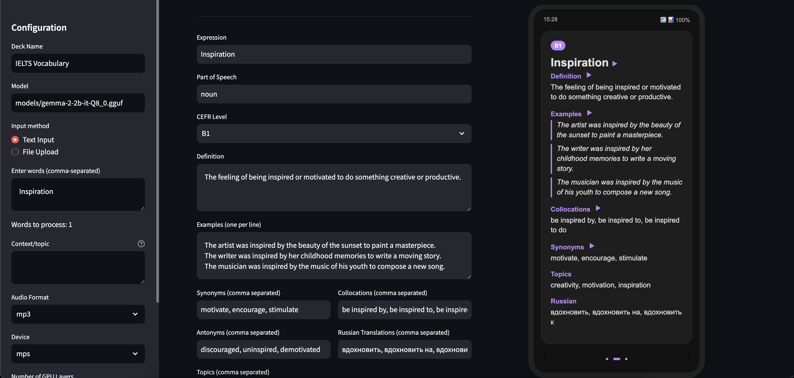

## Overview
lm-anki-cards-creator leverages both small and large language models to generate Anki decks automatically or through user interaction. It simplifies the process of creating effective flashcards for studying and reviewing content from various sources.

## UI Preview


## Features
- **Automatic Generation:** Easily create flashcards from input text(files or through the input field) using advanced language models.
- **Manual Customization:** Tailor generated cards to your specific needs before finalizing your deck.
- **Multi-Model Support:** Utilize different language models based on the task, balancing speed and accuracy.

## Installation
1. Clone this repository:
    ```
    git clone https://github.com/yourusername/lm-anki-cards-creator.git
    ```
2. Navigate to the project directory:
    ```
    cd lm-anki-cards-creator
    ```
3. Install dependencies:
    ```
    pip install -r requirements.txt
    ```
4. Download a pre-trained language model:
  ```bash
  curl -L -o ./models/gemma-2-2b-it-Q8_0.gguf https://huggingface.co/bartowski/gemma-2-2b-it-GGUF/blob/main/gemma-2-2b-it-Q8_0.gguf
  ```
## Usage
- **Automatic Mode:** Run the script with the `--file` or `--words` flag for complete automatic flashcards creation.
  ```
  python main.py --file filename.txt
  ```
- **Manual Mode in UI:** Run the streamlit app to manually customize the deck in the UI.
  ```
  streamlit run streamlit_app.py
  ```

## Recommended Models
- **GEMMA3:**
- **Qwen2.5:**
- **LLama3.2:**
